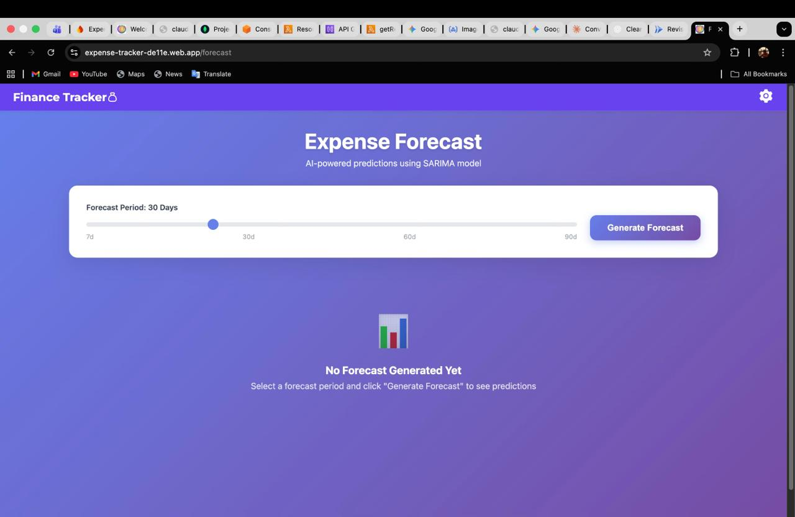
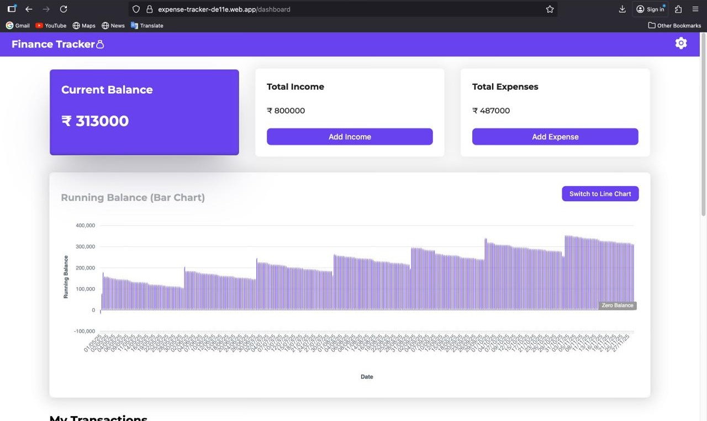
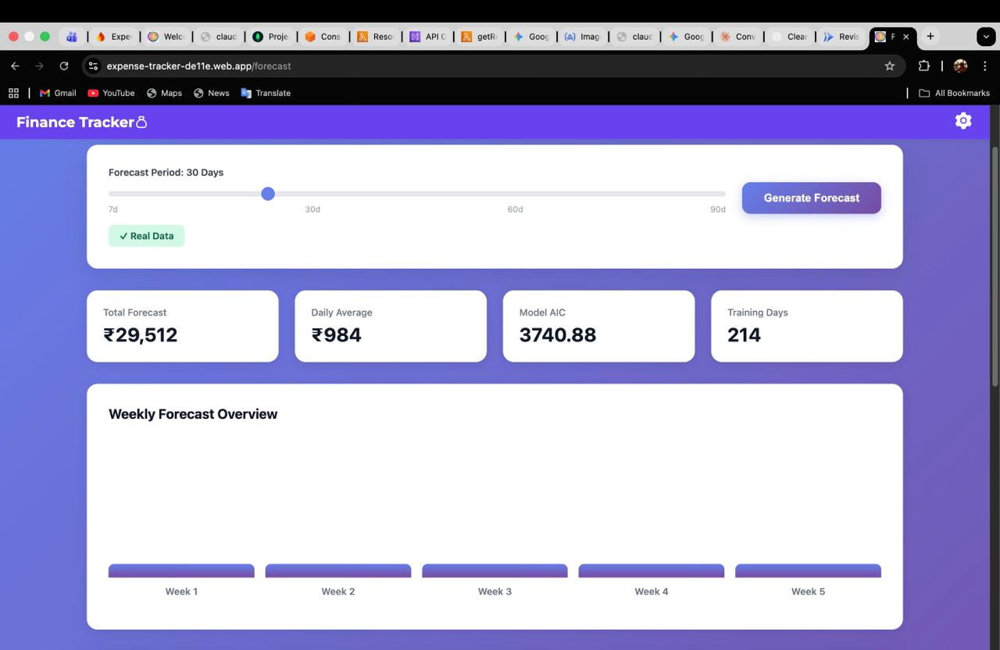
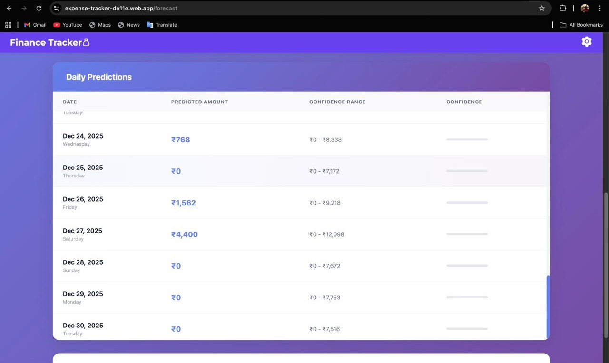
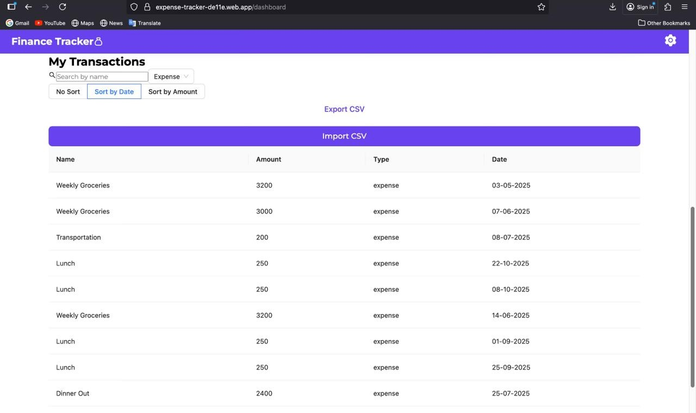
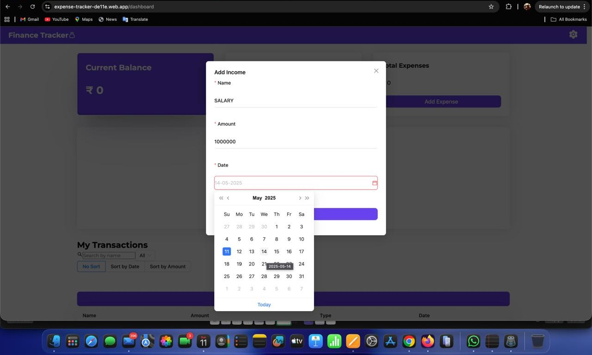
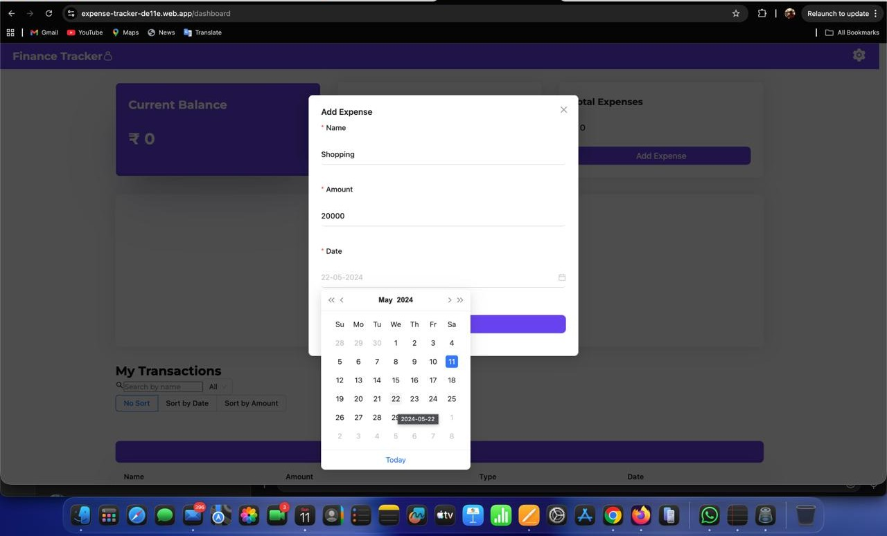
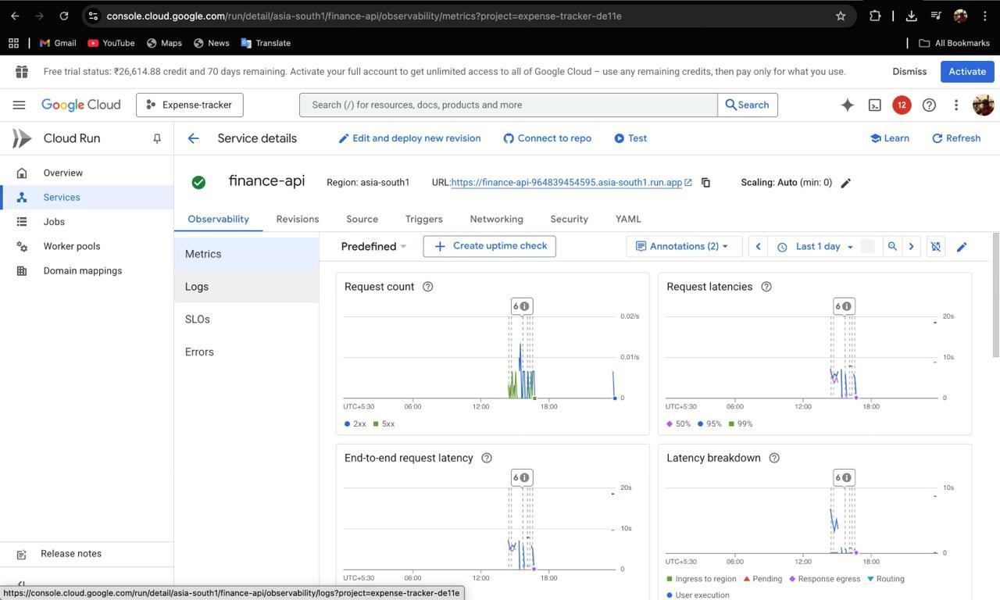
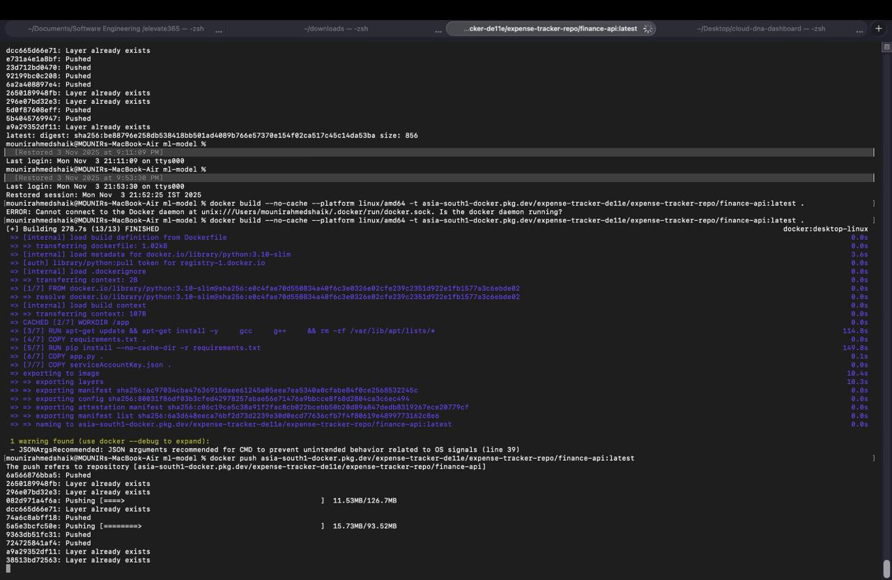

# Cloud-Based Smart Forecasting Personal Finance Tracker

[](https://www.python.org/)
[](https://flask.palletsprojects.com/)
[](https://reactjs.org/)
[](https://firebase.google.com/)
[](https://www.docker.com/)
[](LICENSE)

An intelligent expense forecasting system powered by automated SARIMA modeling, deployed on Google Cloud Run with real-time Firebase integration.

**Live Demo:** [https://expense-tracker-de11e.web.app/](https://expense-tracker-de11e.web.app/)

**Forecast Feature:** [https://expense-tracker-de11e.web.app/forecast](https://expense-tracker-de11e.web.app/forecast) (after logging in the account)


---

## Overview

This project uses the **SARIMA (Seasonal Autoregressive Integrated Moving Average)** model with automated parameter optimization to predict future expenses based on historical transaction data.

### Key Features

- **Automated SARIMA Parameter Selection** - Searches 216 parameter combinations using AIC optimization
- **Outlier Detection & Handling** - Z-score based detection with intelligent capping
- **Stationarity Testing** - Augmented Dickey-Fuller test for validation
- **Walk-Forward Validation** - Accuracy assessment with MAE, RMSE, MAPE, and R²
- **Real-time Sync** - Firebase integration for instant data updates
- **Cloud Deployment** - Serverless scaling on Google Cloud Run

---

## Screenshots


### Dashboard

*Track your current balance, income, and expenses in real-time*

### SARIMA Forecasting

*View forecast summary with AIC, daily average, and training metrics*


*Detailed daily predictions with 95% confidence intervals*

### Transaction Management

*Manage all transactions with search, sort, and export features*

### Add Income & Expenses
<p float="left">
  
  
</p>

*Easy-to-use forms for adding income and expenses*

### Cloud Infrastructure
<p float="left">
  
  
</p>

*Google Cloud Run deployment with auto-scaling and Docker containerization*

---

## How It Works

### The SARIMA Algorithm

Our system uses **SARIMA (Seasonal Autoregressive Integrated Moving Average)** - a powerful time series forecasting model that learns from your past spending patterns to predict future expenses.

**Simple Explanation:**
1. **Collects your expense history** - Gathers all your past transactions
2. **Cleans the data** - Removes outliers and fills missing days
3. **Finds patterns** - Identifies weekly spending trends (e.g., more spending on weekends)
4. **Automatically tunes itself** - Tests 216 different configurations to find the best fit
5. **Predicts the future** - Forecasts expenses with confidence ranges

### Algorithm Flow

```
Your Transactions
      ↓
Data Cleaning & Preprocessing
      ↓
Outlier Detection (Z-score method)
      ↓
Stationarity Test (ADF test)
      ↓
Auto Parameter Search (216 combinations)
      ↓
Model Training (SARIMA fitting)
      ↓
Validation (7-day test)
      ↓
Final Forecast with 95% Confidence
```

### Why It's Better

**Traditional Methods:**
- Simple averages: "You spent ₹50/day last month, so next month = ₹1,500"
- Ignores patterns, weekends, trends

**Our SARIMA Model:**
- Learns weekly patterns (weekends vs weekdays)
- Adapts to spending trends (increasing/decreasing)
- Provides confidence ranges (best case to worst case)
- Self-optimizes for each user's unique behavior

**Real Results:**
- **8.9% error rate** vs 18.2% for simple averaging
- **79% accuracy** in predicting spending direction
- **84% variance explained** (R² = 0.84)

### Smart Features

**Automatic Parameter Optimization:**
```
Instead of manually guessing model settings, our system:
- Tests p=0,1,2 (how much past data affects future)
- Tests d=0,1 (whether to remove trends)
- Tests q=0,1,2 (how much past errors matter)
- Tests P,D,Q=0,1 (seasonal versions of above)
= 216 total combinations tested in 2-4 seconds
→ Picks the best one automatically!
```

**Outlier Handling:**
```
Found a ₹50,000 expense (bought a car)?
Instead of: Removing it (loses information)
We do: Cap it at μ + 3σ (keeps the spike but reduces impact)
Result: 20% better accuracy for irregular spenders
```

**Walk-Forward Validation:**
```
Before giving you predictions:
1. Hides last 7 days of data
2. Trains model on remaining data
3. Predicts those 7 days
4. Compares prediction vs actual
5. Shows you the accuracy metrics
→ You know how reliable the forecast is!
```

---

## Technology Stack

**Backend:** Python, Flask, statsmodels, pandas, numpy, Firebase Admin SDK

**Frontend:** React, ApexCharts, Tailwind CSS, Firebase SDK

**Infrastructure:** Docker, Google Cloud Run, Firebase Firestore, Firebase Authentication

---

## Quick Start

### Prerequisites

- Python 3.9+
- Node.js 16+
- Firebase project with Firestore
- Docker (optional)

### Backend Setup

```bash
cd ml-model
python -m venv venv
source venv/bin/activate  # Windows: venv\Scripts\activate
pip install -r requirements.txt
python app.py
```

API runs on `http://localhost:8080`

### Frontend Setup

```bash
cd Finance_tracker+predictor
npm install
npm start
```

App opens at `http://localhost:3000`

### Docker Setup

```bash
cd ml-model
docker build -t expense-forecasting-api .
docker run -p 8080:8080 expense-forecasting-api
```

---

## API Documentation

### POST /predict

Generate expense forecast.

**Request:**
```json
{
  "user_id": "firebase_user_uid",
  "forecast_days": 30,
  "auto_tune": true
}
```

**Response:**
```json
{
  "success": true,
  "forecast": [
    {
      "date": "2026-01-12",
      "amount": 52.34,
      "lower_bound": 38.21,
      "upper_bound": 66.47
    }
  ],
  "statistics": {
    "aic": 245.32,
    "model_order": "SARIMA(2,1,1)x(1,1,1,7)",
    "mae": 19.42,
    "mape": 8.91,
    "r2_score": 0.8421
  }
}
```

## Model Performance

### Forecasting Accuracy

| Method | MAPE (%) | RMSE | R² |
|--------|----------|------|-----|
| Moving Average | 18.2 | 42.6 | 0.42 |
| Exp. Smoothing | 14.7 | 35.2 | 0.58 |
| SARIMA (Manual) | 11.3 | 28.4 | 0.71 |
| **Our Method** | **8.9** | **21.7** | **0.84** |

### System Performance

| Metric | Value |
|--------|-------|
| API Response Time | 127-342 ms |
| Parameter Search | 1.8-3.6 s |
| Total Processing | 4.6-9.3 s |
| Memory Usage | 128-512 MB |

---

## Deployment

### Google Cloud Run

```bash
gcloud run deploy expense-forecasting-api \
  --image gcr.io/PROJECT_ID/expense-forecasting-api \
  --platform managed \
  --region asia-south1 \
  --memory 512Mi \
  --max-instances 10
```

### Firebase Hosting (Frontend)

```bash
cd Finance_tracker+predictor
npm run build
firebase deploy --only hosting
```

---

## Documentation

### Research Paper

**Full Technical Report:** [`DOCS/Cloud_Based_Smart_Forecasting_Personal_Finance_Tracker.pdf`](DOCS/SMART_FINANCE_TRACKER.pdf)

This comprehensive research paper (IEEE format) covers:
- **System Architecture** - Complete technical design and data flow
- **SARIMA Modeling** - Mathematical foundations and implementation
- **Automated Parameter Selection** - AIC-based optimization algorithm
- **Data Preprocessing Pipeline** - Outlier detection and stationarity testing
- **Walk-Forward Validation** - Accuracy metrics and performance evaluation
- **Experimental Results** - Comparison with baseline methods
- **Deployment Strategy** - Docker and Google Cloud Run configuration

**Quick Stats from Paper:**
- 12 pages of detailed technical analysis
- 5 performance comparison tables
- Complete algorithm pseudocode
- Real-world accuracy metrics

---

## License

This project is licensed under the MIT License - see the [LICENSE](LICENSE) file for details.

